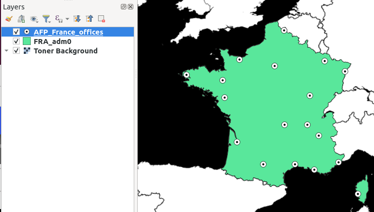
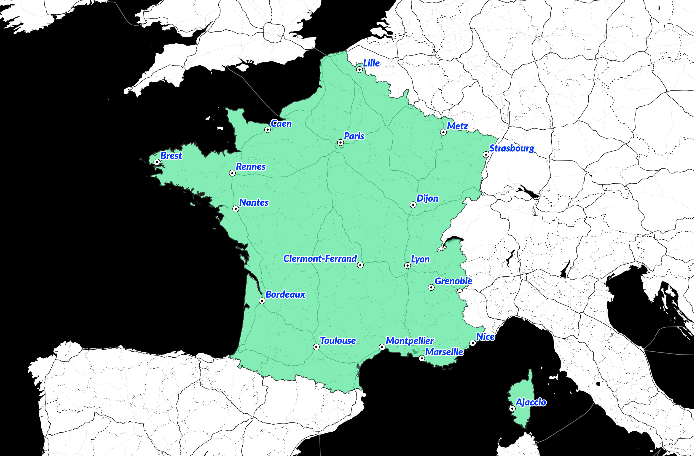

This guide is a step by 

## Finding the office data

The [AFP in the world](https://www.afp.com/en/agency/about/afp-world) page lists the locations of the AFP's hubs across the world, spanning 151 countries and more than 260 offices. The information is presented in the form of an embedded Google Maps layout, with markers indicating the location of each office.

Clicking **FRANCE** on the quick access tab shows us the 18 office locations in that country.


We want to create a custom map of these office locations using QGIS, so first, we need a list of all of the offices with location coordinates. We know that the Google Maps widget is loading a list of these office locations from somewhere, so we can look at the network requests made by the browser to try and find where this happens. 

If we open the browser console and check the `Network` tab, we can see all of the network requests made by this page. Filtering by type `XHR`, we can find requests where the browser is using the `XMLHttpRequest` protocol to communicate with a server and receive a JSON file, which is the format that the list of office locations will be in.

Sure enough, when we filter by XHR, we see that a JSON file is being requested from the URL `afp.com/en/afp/map/getoffice/427`, which looks like an API endpoint to get a list of offices.


We can confirm this by this visiting the URL directly in a browser, which gives us a JSON response with a list of offices.


### Converting to GeoJSON

So, we want to take the list of offices and load it into QGIS, but to do this, we need to convert the JSON into GeoJSON format.

The specification page at [geojson.org](https://geojson.org/) gives the following reference example:

```json
{
  "type": "Feature",
  "geometry": {
    "type": "Point",
    "coordinates": [125.6, 10.1]
  },
  "properties": {
    "name": "Dinagat Islands"
  }
}
```

From this example, we can infer that each office needs to be stored as a `type: Feature` with the location name and its latitude-longitude coordinates. By further reading the GeoJSON specification, we learn that all of the offices together should be grouped as a feature collection.

We can do this with the following Python script:
```python
import json
import requests  

r = requests.get('https://www.afp.com/en/afp/map/getoffice/427')

office_list = r.json()
off = office_list['offices']

# Convert JSON entry for office to GeoJSON Feature
def office_to_geojson_feature(office_json):
	name = office_json['location_city']
	latitude = float(office_json['location_latitude'])
	longitude = float(office_json['location_longitude'])

	oj = {"type": "Feature",
		   "geometry":
		     {"type": "Point",
		      "coordinates": [longitude, latitude]
		     },
		     "properties":
		        {"name": name}
		 }
	return oj

# Build list of office GeoJSON Features
offices = []
for o in off:
	offices.append(office_to_geojson_feature(o))

# Group together as GeoJSON FeatureCollection
office_geojson = {
	"type": "FeatureCollection",
	"features": offices
}

# Save file and close
with open("AFP_France_offices.geojson", 'w') as f:
	json.dump(office_geojson, f)
f.close()
```
Now we have a GeoJSON-formatted list of all the AFP offices in France, ready to load into QGIS.

## Creating map in QGIS

First we'll need to find some tiles to use as the base layer for our map of AFP office locations. Since the GeoJSON file already has a name label for each office, we can look for a map that contains only background detail with no labels. A good option here is the [Toner Background map](http://maps.stamen.com/toner-background/#8/37.771/-122.377), by Stamen.

To add the map tiles into QGIS we need to find the URL template for the map. The documentation from Stamen shows that their map URLs are in the format: `https://stamen-tiles.a.ssl.fastly.net/toner-background/{z}/{x}/{y}.png`

In QGIS, we right click "XYZ Tiles > New Connection" and paste in the tile URL. The Toner Background tile map can then be selected as the base of our project.


We now have a map of the entire world, but ideally we'd like to highlight the borders of France. To do this we need a shapefile with France's administrative boundaries, which we can find at [Diva-GIS.org](http://www.diva-gis.org/gdata).


After we have downloaded the shapefile and loaded it into QGIS, we can see a new layer with France's administrative borders, which is coloured green on the map.


Now we're ready to add in the GeoJSON layer with the locations of all AFP offices in France. 

By default, QGIS will add the coordinates to the map, but does not add any labels.

If we right click the `AFP_France_offices` layer and select "Show labels," we can add the names of the offices to the map. We can also change the styling of the labels to match the blue AFP colour, and add a white outline to improve the legibility.

Et voilà! We have now created our own custom map illustration showing all AFP office locations in France. 


